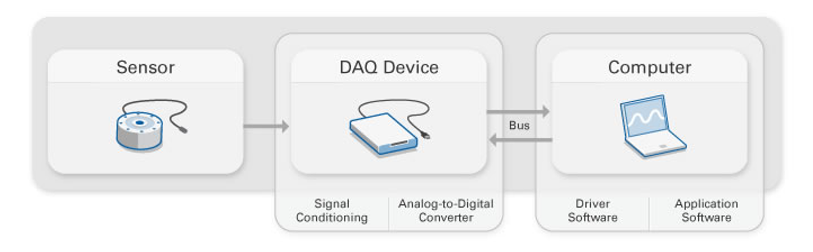
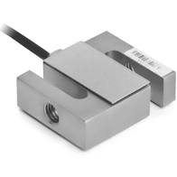
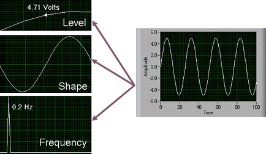
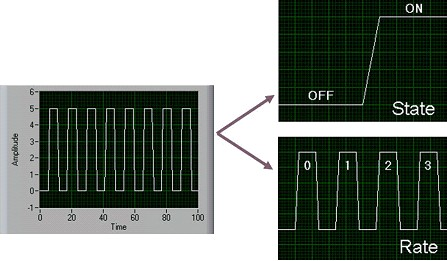
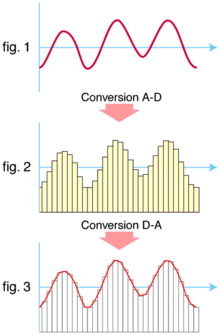
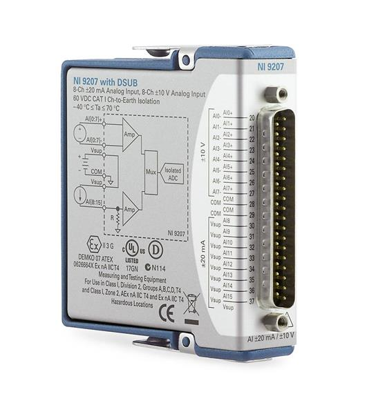
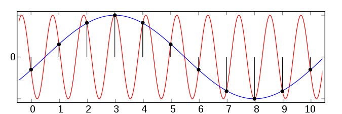

.. _daqintro_index:

Data Acquisition Systems
========================

  `A data acqusition system (Image: NI.com) <http://www.ni.com/data-acquisition/what-is/>`_

Data acqusition systems consist of three main components:

#. Sensors to measure physical systems.
#. Signal conditioning/conversion.
#. A computing device with interfacing drivers and software for data monitoring/collection.

Sensors
^^^^^^^

  `An S beam load cell  (Image: omega.com) <http://t0.gstatic.com/images?q=tbn%3AANd9GcSB1OSzneITOKJS24IgPwrPvN3oWgLkV0Zln0aDidu271lG6Ox5wQ61nyRI73_j9KTLfqH1g-G_&usqp=CAc>`_

Sonsors are sometimes called `transducers`, they are devices that covert physical quantities in the real world to electrical signals such voltage, current and resistance, etc. Most sensors needs electric excitaion (DC/AC power supply) and will output either analog or digital signals representing measured physical quantities.

=============== =============
       Common Sensors
-----------------------------
Sensors         Phenomenon
=============== =============
Thermocouple    Temperature
Photo Sentor    Light
Microphone      Sound
Loadcell        Force
Strain gauge    Strain
Accelerometer   Acceleration
Hygrometer      Humidity
Seismometer     Ground motion
=============== =============

Signal Conversion/Conditioning
^^^^^^^^^^^^^^^^^^^^^^^^^^^^^^

Signal conversion and conditioning are the essential components of a data acquisition system. The output signals from the sensors can be catagorized as **Analog** and **Digital**.

Analog Signal
^^^^^^^^^^^^^

Analog signals cover a wide range of physical phenomenon. The colors we see, the tones we hear, the temperatures that we feel, etc. There are infinite numbers of such analog signals.

In the perspective of data acquisition, analog signals are continuous and features three primary characteristics:

1. Level (Amplitude)
2. Shape
3. Frequency

  `Primary characteristics of an analog signal  (Image:ni.com) <https://ni.scene7.com/is/image/ni/clip_image001_20080722134950?scl=1>`_

Common analog signals include voltage, current, resistance, etc. Analog signals always inherently contain some degree of noise. Therefore, signal conditioning is usually needed for raw analog signals. Analog signals also need to be convereted to digital signals for communication and storage in computing devices.

Digital Signal
^^^^^^^^^^^^^^

Digital signals are finite, with a predefined range, meaning there is a limited values set they can be. How many values in a predefined values set depends on the total number of levels defined in the set. Due to the binary nature of modern computing devices, the number of levels is defined by  2\ :sup:`N`, where the exponent **N** is called ``bit``, the ``bit`` value is widely adopted in the industry for representing the resolution of digital signals.

Digital signals are discrete and features two primary characteristics:

1. State
2. Rate

  `Primary characteristics of an digital signal  (Image:ni.com) <https://ni.scene7.com/is/image/ni/021afe6997?scl=1>`_

Digital signals are more resistant to noise, therefore they are widely used for data transmission protocols such as `HDMI` for video and audio, MIDI, I\ :sup:'2'S, and AC`97 for audio. Many instruments for laboratory are developed with proprietary digital commmunication protocols. Keep in mind that not all instrument manufactures are willing to disclose their communication protocol because of intellectual property protection or other reasons. Knowing whether the communication protocol is available for an instrument of interest can be extremely beneficial for future expandability and maintainability.

Analog to Digital Conversion
^^^^^^^^^^^^^^^^^^^^^^^^^^^^

The most common signal types we encounter in the laboraotry are analog. However, analog signals cannot be directly stored in computing devices without being converted in to digital signals. An **analog to digital converter (ADC)** does exactly that. An analog to digital converter takes discrete samples from the continuous analog signal with a preset sampling rate (frequency). reverse process of converting digital signals to analog signals can be performed by a **digital to analog converter (DAC)**

  `Analog to digital conversion (Image:wikipedia) <https://upload.wikimedia.org/wikipedia/commons/thumb/5/5a/Conversion_AD_DA.png/220px-Conversion_AD_DA.png>`_

  `An ADC Module  (Image:ni.com) <https://m.artisantg.com/itemimages/National_Instruments_NI_9207_View1_2018719152210.jpg>`_

Keep in mind that higher ``bit`` resolution of an ADC means steeper price tag. When choosing a ADC, consider a resonable resolution with a acceptable budget.

Digital Sampling and Nyquist Frequency
^^^^^^^^^^^^^^^^^^^^^^^^^^^^^^^^^^^^^^

Becasue ADCs convert analog signals to digital signals by sampling, the sampling rate has to be much faster than the maximum frequency of the input analog signal in order to get a relatively good conversion. Take a look at the graph below:

  `Red: input analog signal; Blue: sampled signal. Becasue sampling rate is too low, the converted signal looks nothing like the input signal, the resulting phenomenon is called aliasing (Image: wikipedia) <https://commons.wikimedia.org/wiki/File:AliasingSines.svg>`_

The **Nyquist Sampling Rate** is defined as **two** times the highest frequency of the input signal. The Nyquist sampling rate is the minimum sampling rate required to avoid aliasing. However, in laboratory tests, ADC sampling rate should be at least **ten** times higher than the highest input frequency.

.. toctree::
   :maxdepth: 1