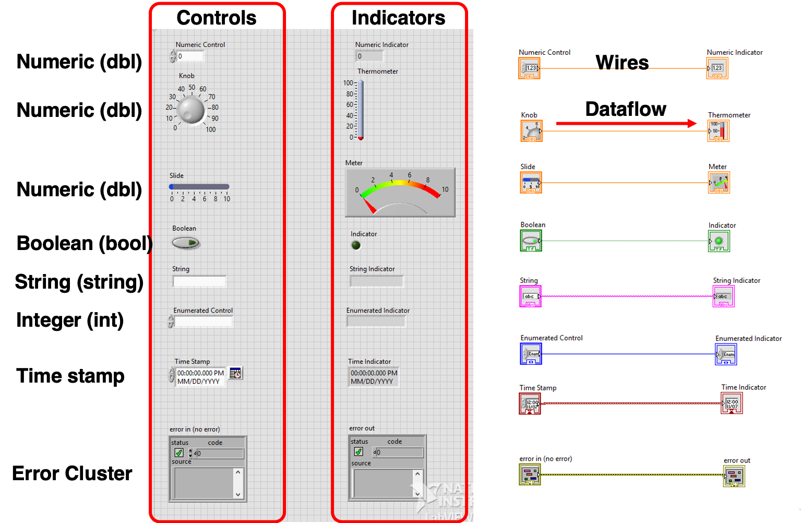

.. _control_indicator_index:

Example Code: Controls and Indicators
=====================================

Overview
^^^^^^^^

This example VI demonstrates controls and indicators containing different types of data.

  `Front panel and block diagram of controls_indicators.vi`

Behavior
^^^^^^^^

If data is initialized in the control object, the same data should be passed to and shown in the corresponding indicators.

:download:`controls_indicators.vi <controls_indicators.vi>`

