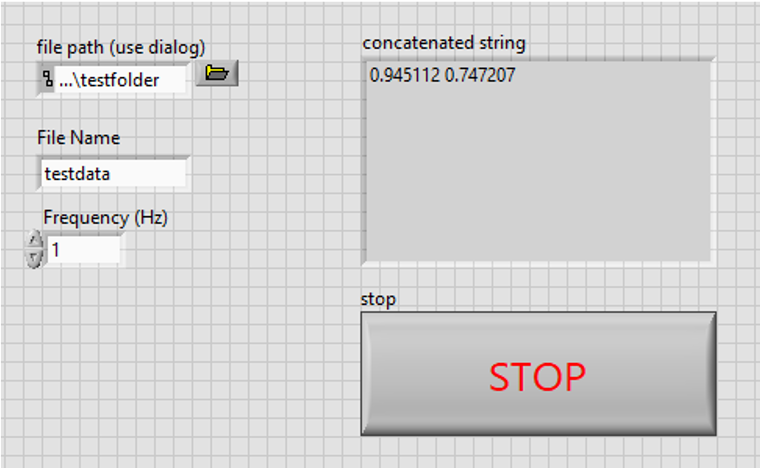
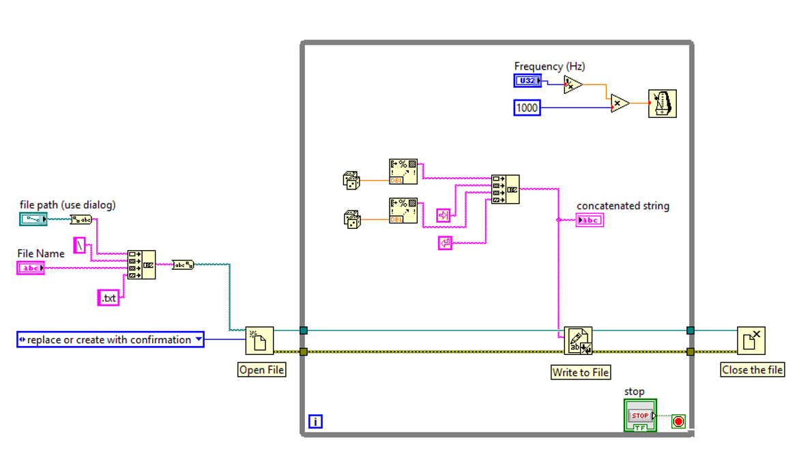

.. _fileio_index:

Example Code: File IO
=====================

Overview
^^^^^^^^

This example VI demonstrates a simple case of file I/O. If executed, the VI opens a new file, names the file, writes data to the file in a format of two columns, and finally saves the file at the specified directory.

  `Front panel of fileIO.vi`

  `Block diagram of fileIO.vi`

Behavior
^^^^^^^^

A file path and file name need to be specified in order to execute the VI. Two random numbers are generated and saved in a format of two columns in the specified frequency. The VI is stopped once the stop button is pressed.

:download:`fileIO.vi <fileIO.vi>`

