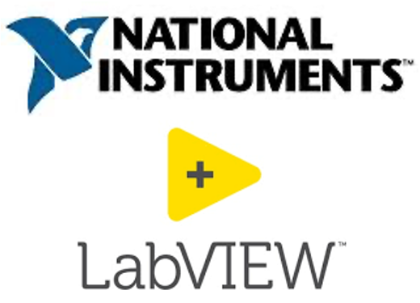
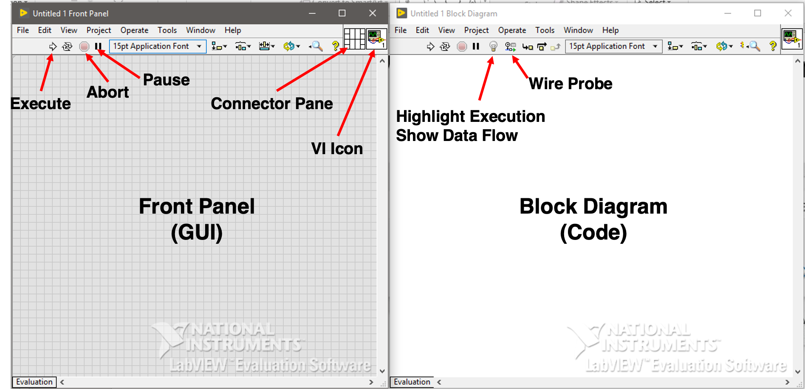
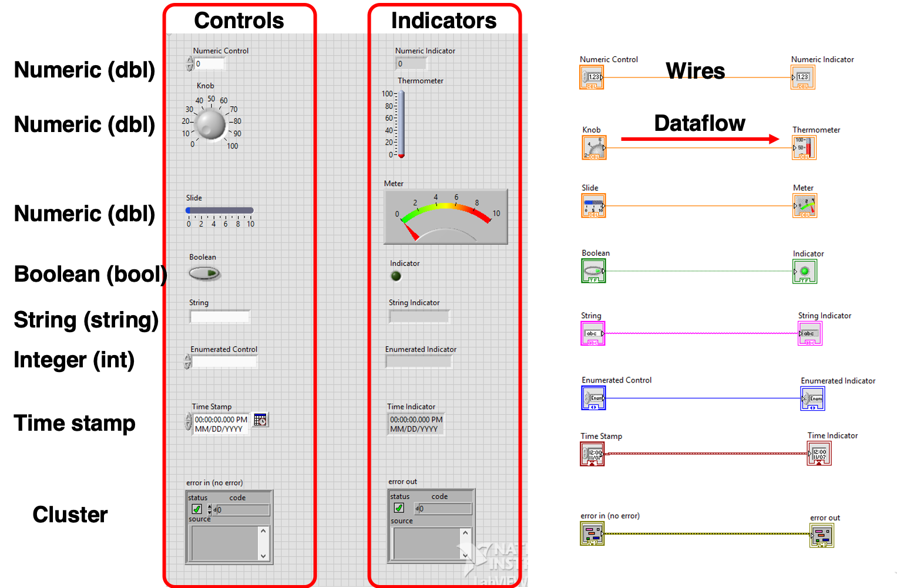

.. _labview_index:

LabVIEW Graphical Programming
=============================

“LabVIEW is systems engineering software for applications that require test, measurement, and control with rapid access to hardware and data insights.” – `National Instruments <https://www.ni.com/en-us/shop/labview.html?cid=Paid_Search-a240Z0000045OsuQAE-Consideration-Labview_exact&s_kwcid=AL!6304!3!377482054773!e!!g!!labview&gclid=Cj0KCQiAm4TyBRDgARIsAOU75sqTRflPyHx7Hhczibb1FNsigmD8U6Re8D6s6KjHnBh3lQLrG0wWjAwaAlUcEALw_wcB>`_

**My take**: LabVIEW is a graphical programming platform to integrate sensors, signal conditioner/converter, and computing devices.

Why LabVIEW?
^^^^^^^^^^^^

There are many options out there in terms of integrating DAQ systems. However, LabVIEW is the among the most intuitive tools that can be implemeted quickly and effectively. Here are my opinions on the pros of using LabVIEW to integrate DAQ systems in geoscientific experimentation.

#. Graphical User Interface (GUI).
#. Easy to implement for controls and automated data acquisition systems.
#. Support for a wide range of sensors and devices.
#. Natural integration with equipment made by National Instruments.
#. Easy distribution and reliability (if built properly).
#. A knowledgeable community (`NI LabVIEW Forum <https://forums.ni.com/t5/LabVIEW/bd-p/170?profile.language=en>`_) with active scientists and engineers solving real life problems using LabVIEW.

LabVIEW Virtual Instruments (VI)
^^^^^^^^^^^^^^^^^^^^^^^^^^^^^^^^

The programming interface for labview is called a **Virtual Instrument** or as known as a **VI**, this is an analogy for the real instrument panel people used to work with. A blank VI interface is shown as below.

  `A blank LabVIEW Virtual Instrument (VI)`

The front panel of a VI hosts components that users interact with, the block diagram hosts the underlying code blocks. In LabVIEW, a code block consists of objects (shown as graphical glyphs or as known as nodes) and wires. Typical LabVIEW objects include:

#. Controls
#. Indicators
#. Functions
#. Structures

To learn more on the VI interface and block diagram, please follow these guides: `LabVIEW Environment Basics <https://www.ni.com/getting-started/labview-basics/environment>`_ and `LabVIEW Block Diagram Explained <https://www.ni.com/en-us/support/documentation/supplemental/08/labview-block-diagram-explained.html>`_

The  The following figure shows some commonly used controls and corresponding indicators on the front panel and block diagram.

The programming interface for labview is called a **Virtual Instrument** or as known as a **VI**, this is an analogy for the real instrument panel people used to work with. A blank VI interface is shown as below.

  `A sample VI shows common controls and indicators`

.. toctree::
   :maxdepth: 1