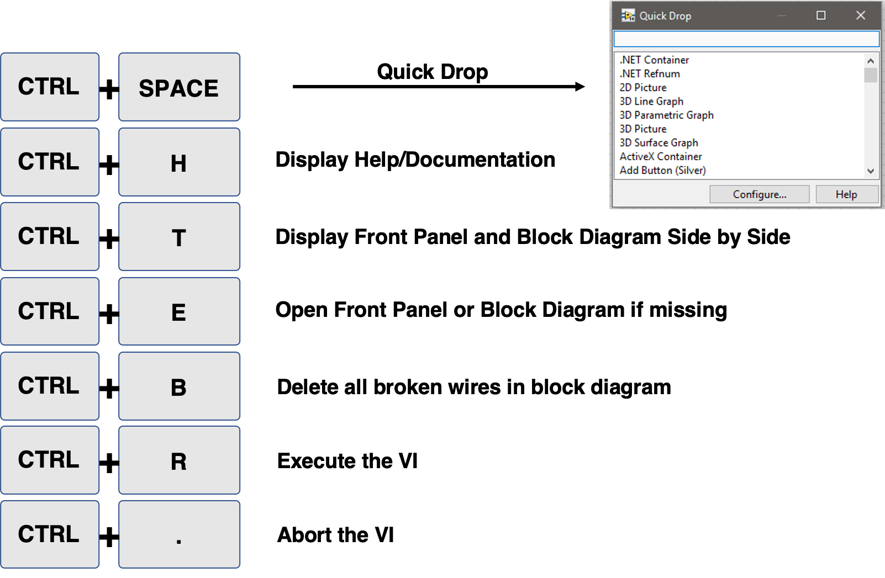
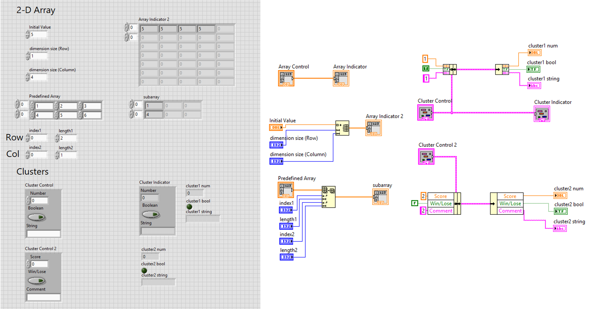
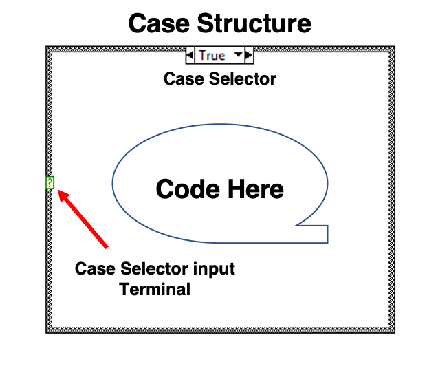
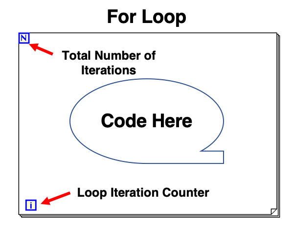
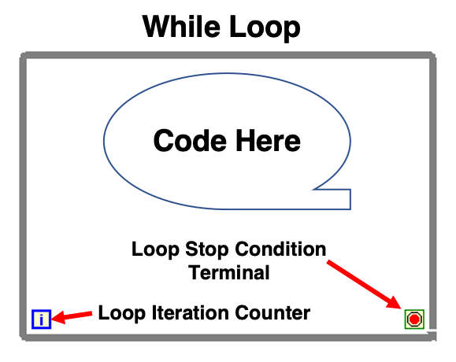
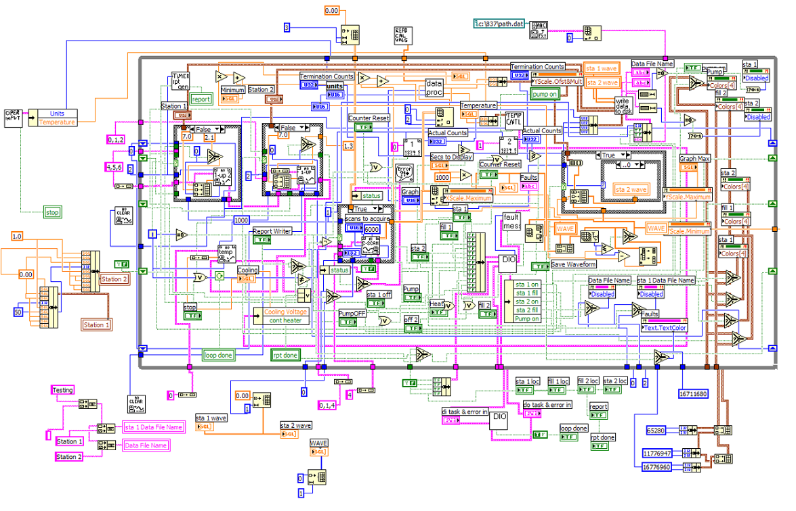
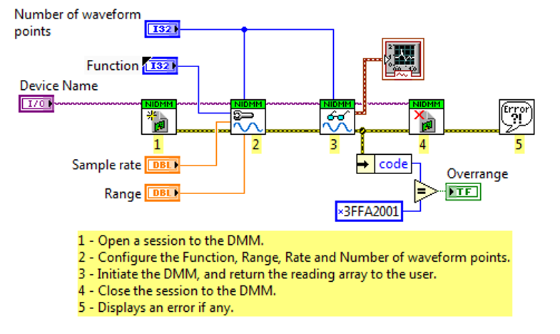

.. _labview_index:

LabVIEW Graphical Programming
=============================

.. image:: ./images/labview-logo.png
  :align: center
  :scale: 70%

“LabVIEW is systems engineering software for applications that require test, measurement, and control with rapid access to hardware and data insights.” – `National Instruments <https://www.ni.com/en-us/shop/labview.html?cid=Paid_Search-a240Z0000045OsuQAE-Consideration-Labview_exact&s_kwcid=AL!6304!3!377482054773!e!!g!!labview&gclid=Cj0KCQiAm4TyBRDgARIsAOU75sqTRflPyHx7Hhczibb1FNsigmD8U6Re8D6s6KjHnBh3lQLrG0wWjAwaAlUcEALw_wcB>`_

**My take**: LabVIEW is a graphical programming platform to integrate sensors, signal conditioner/converter, and computing devices.

Why LabVIEW?
^^^^^^^^^^^^

There are many options out there in terms of integrating DAQ systems. However, LabVIEW is the among the most intuitive tools that can be implemeted quickly and effectively. Here are my opinions on the pros of using LabVIEW to integrate DAQ systems in geoscientific experimentation.

#. Graphical User Interface (GUI).
#. Easy to implement for controls and automated data acquisition systems.
#. Support for a wide range of sensors and devices.
#. Natural integration with equipment made by National Instruments.
#. Easy distribution and reliability (if built properly).
#. A knowledgeable community (`NI LabVIEW Forum <https://forums.ni.com/t5/LabVIEW/bd-p/170?profile.language=en>`_) with active scientists and engineers solving real life problems using LabVIEW.

LabVIEW Virtual Instruments (VI)
^^^^^^^^^^^^^^^^^^^^^^^^^^^^^^^^

The programming interface for labview is called a **Virtual Instrument** or as known as a **VI**, which is an analogy for the real instrument panel people used to work with. A blank VI interface and its common functions are shown as below.

.. figure:: ./images/vi.png
  :align: center
  :scale: 40%

  `A blank LabVIEW Virtual Instrument (VI)`

Here are some useful shortcuts for common LabVIEW GUI manipulation.

The front panel of a VI hosts components that users interact with, the block diagram hosts the underlying code blocks. In LabVIEW, a code block consists of objects (shown as graphical glyphs or as known as nodes) and wires. Typical LabVIEW objects include:

#. Controls
#. Indicators
#. Functions
#. Structures

To learn more on the VI interface and block diagram, please follow these guides: `LabVIEW Environment Basics <https://www.ni.com/getting-started/labview-basics/environment>`_ and `LabVIEW Block Diagram Explained <https://www.ni.com/en-us/support/documentation/supplemental/08/labview-block-diagram-explained.html>`_

Controls, Indicators, and Wires
^^^^^^^^^^^^^^^^^^^^^^^^^^^^^^^

The following snapshot of a simple VI shows some commonly used control and corresponding indicator objects on the front panel and block diagram. Each control or indicator object holds data of a certain type, for instance, a numeric control/indicator holds a double precision float number by default. Each control/indicator object in the block diagram features a outline with a distinctive color depending on its data type. The objects in the block digram are connected by so called wires. Data always flow from left to right through the wires in the block diagram.

.. figure:: ./images/controls-indicators.png
  :align: center
  :scale: 40%

  `A simple VI shows common controls and indicators`

To learn more about controls, indicators, and wires, please follow this `guide <https://www.labviewmakerhub.com/doku.php?id=learn:tutorials:labview:basics:controls_indicators>`_ by `LabVIEW MakerHub <https://www.labviewmakerhub.com/>`_.

Arrays and Clusters
^^^^^^^^^^^^^^^^^^^

User can define arrays and clusters using LabVIEW. Arrays and clusters can be either controls or an indicators. An array can be multi-dimensional with variable size and contains ordered elements of the same data type. Clusters can contain different data types but the size of a cluster cannot vary once defined. Arrays and clusters cannot hold controls and indicators at the same time. The following VI demonstrates the implementation of arrays and clusters.

  `A VI shows the implementation of arrays and clusters`

To learn more about arrays and clusters data structure, please follow the guide: `LabVIEW Arrays and Clusters Explained <https://www.ni.com/en-us/support/documentation/supplemental/08/labview-arrays-and-clusters-explained.html>`_

Loops and Case Structures
^^^^^^^^^^^^^^^^^^^^^^^^^

Loops and case structures are execution structures in LabVIEW.

A **case structure** contains two or more sub-diagrams of code, only one piece of the code diagram (one case) is visible and can be excecuted at a time.

  `An example of Case Structure`

A **for loop** excecute a sub-diagram of code for a set number of iterations.

  `An example of For Loop`

A **while loop** keeps excecuting a sub-diagram of code until a loop stop condition is met.

  `An example of While Loop`

It is important to avoid infinite loop mistakes when using while loops. To learn more about excecution structures, please follow the guide: `Excecution Structures in LabVIEW <https://www.ni.com/getting-started/labview-basics/execution-structures#Case%20Structures>`_

LabVIEW Coding Style
^^^^^^^^^^^^^^^^^^^^

The `spaghetti code` can get really complicated if not well planned in constructing the block diagram. See the following comparison between two code diagrams, you can get an idea how important it is to plan your code diagram and write clean, readable codes. Writing sub-VIs, bundling data into clusters, constructing codes as state-machines are good practices to make your code looking clean and professional.

  `An example of bad LabVIEW coding style (Image: NI forum) <https://forums.ni.com/t5/Random-Ramblings-on-LabVIEW/LabVIEW-Smells-Anti-patterns/ba-p/3480129?profile.language=en>`_

  `An example of good LabVIEW coding style (Image: digilentinc.com) <https://blog.digilentinc.com/tips-for-creating-professional-looking-vis-in-labview/>`_

.. toctree::
   :maxdepth: 1