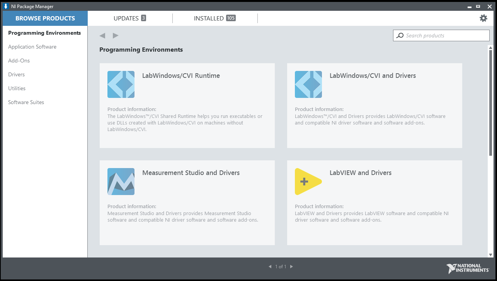
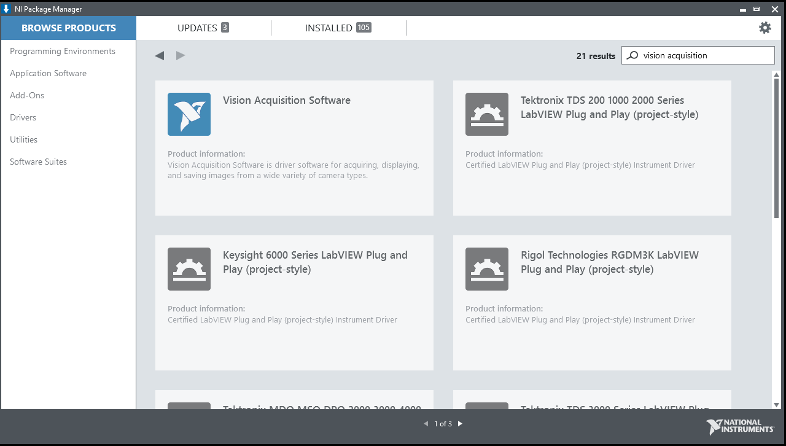
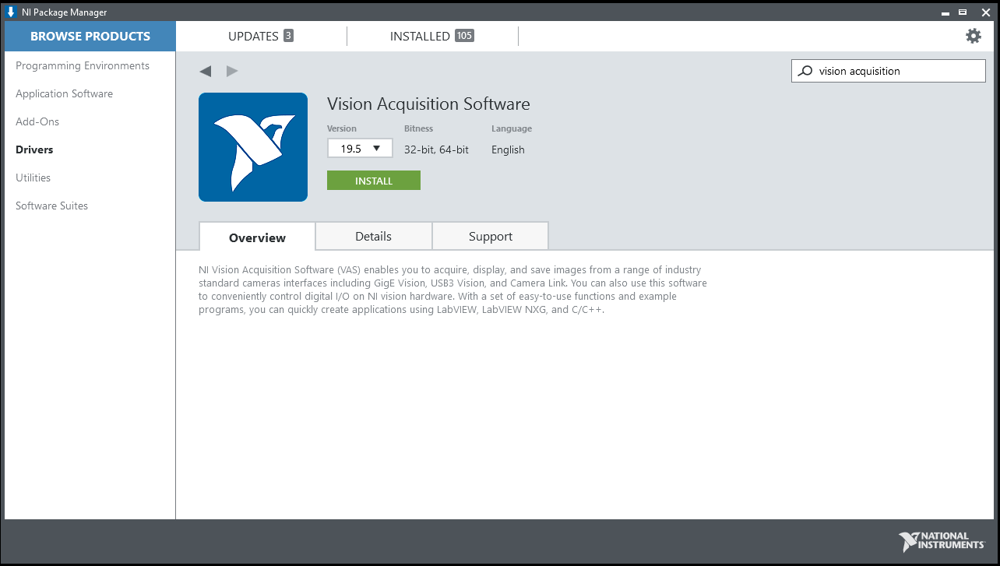
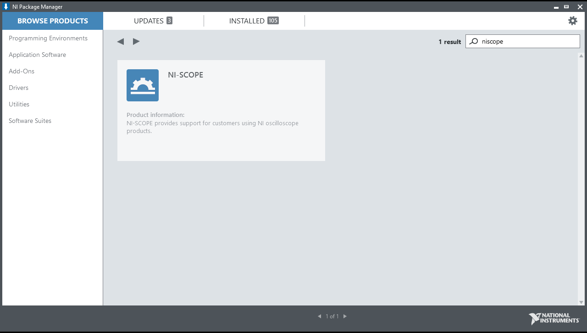
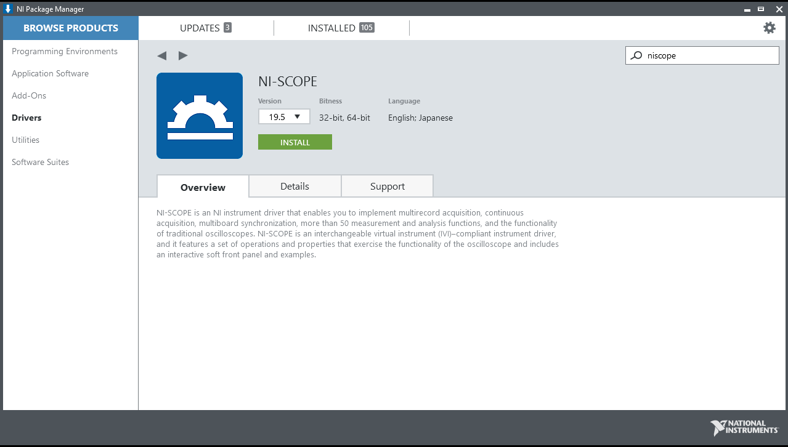

.. _resources_index:

Useful Resources
================

Vision Acquisition Drivers Installation
^^^^^^^^^^^^^^^^^^^^^^^^^^^^^^^^^^^^^^^

The following guide shows how to install vision acquisition drivers (IMAQ) for LabVIEW developing environment.

Search **NI Package Manager** using the Windows search box, and launch the application.

Once launched, search for **Vision Acquisition Software** in the search box located at the upper-right corner of the window,

Install the **Vision Acquisition Software** by clicking **Install**.

NI-Scope Drivers Installation
^^^^^^^^^^^^^^^^^^^^^^^^^^^^^

The following guide shows how to install NI-Scope drivers for LabVIEW developing environment. The drivers provides support for LabVIEW to communicate with supported oscilloscopes.

Search **NI Package Manager** using the Windows search box, and launch the application.

Once launched, search for **NI-Scope** in the search box located at the upper-right corner of the window,

Install the **NI-scope** drivers by clicking **Install**.

.. toctree::
   :maxdepth: 2