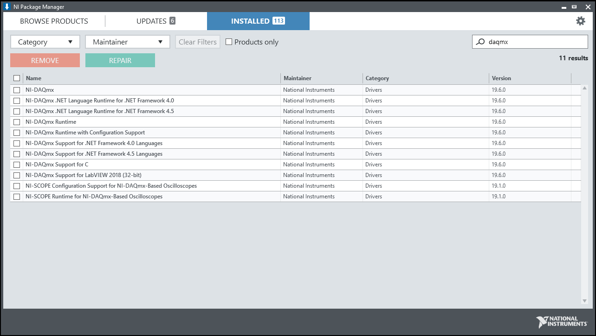
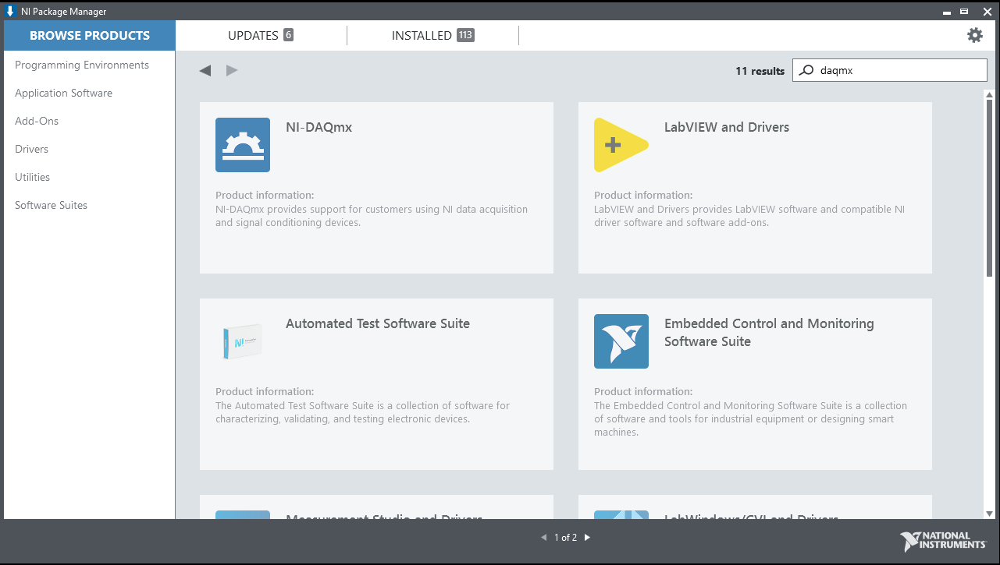
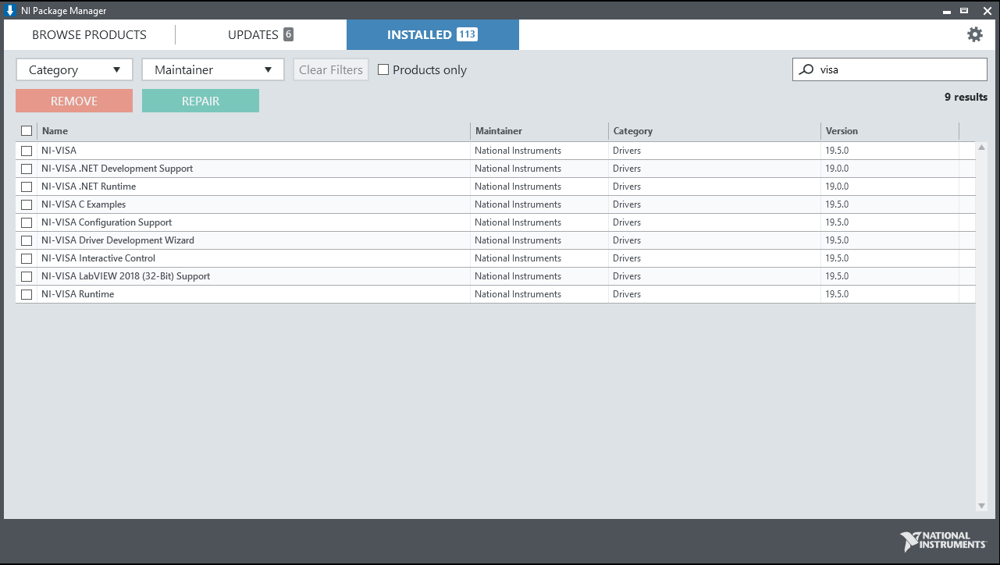
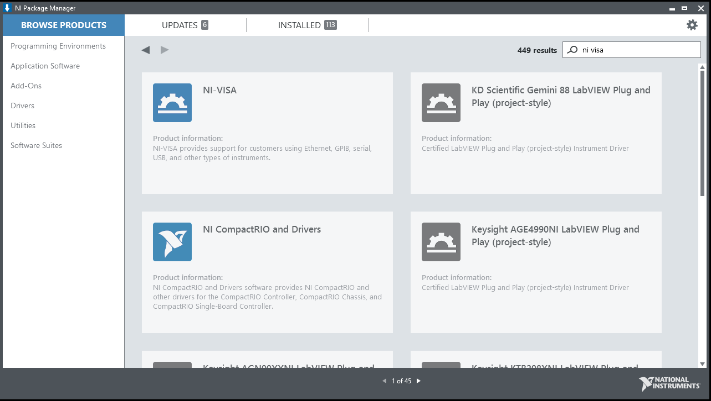
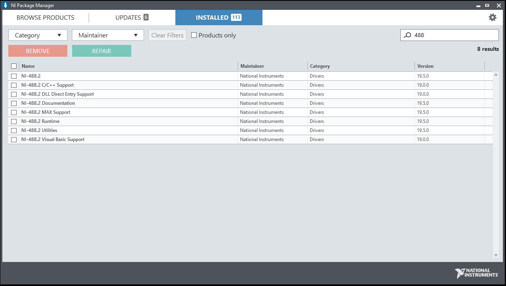
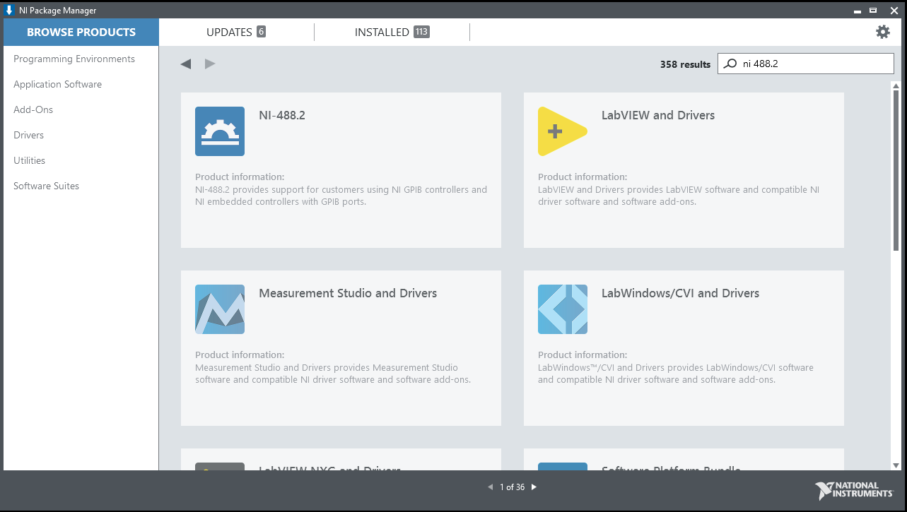
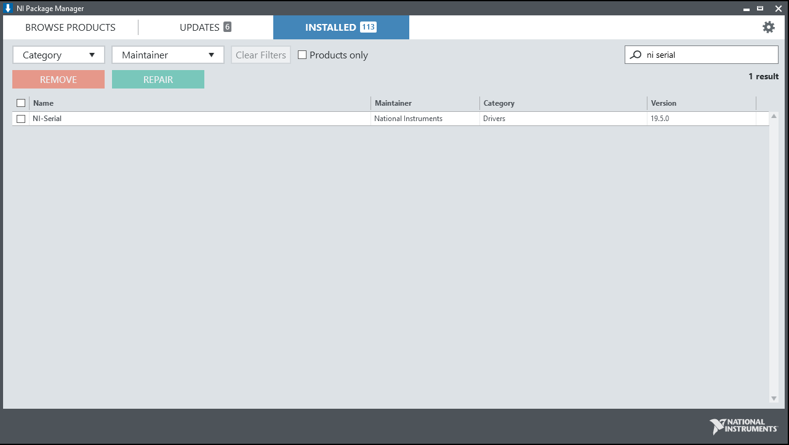
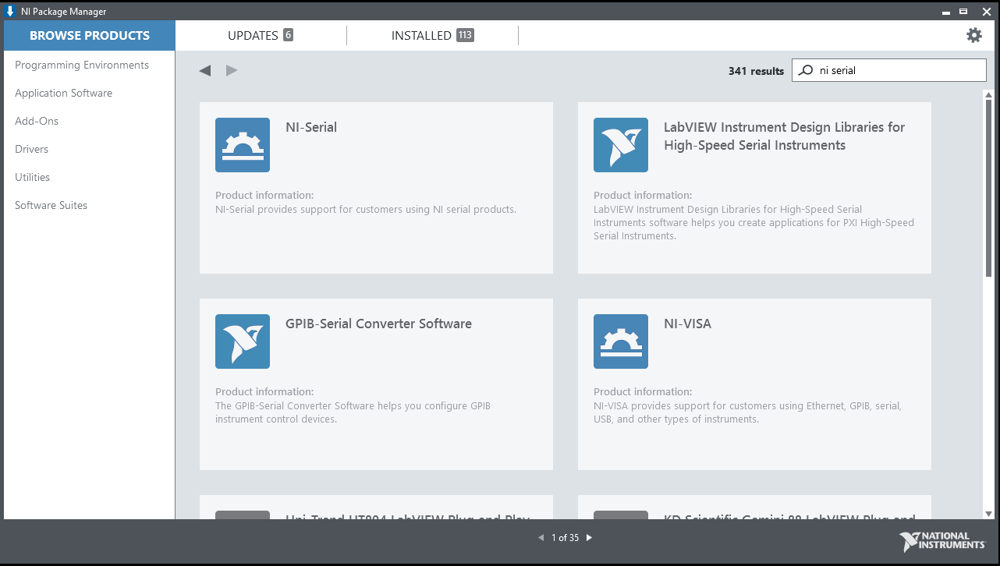

.. _resources_index:

Useful Resources
================

NI DAQmx Drivers Installation
^^^^^^^^^^^^^^^^^^^^^^^^^^^^^

NI-DAQmx provides support for customers using NI data acquisition and signal conditioning devices.
NI-DAQmx is an NI instrument driver that controls every aspect of your DAQ system, including signal conditioning, from configuration to programming in LabVIEW to low-level OS and device control. You can build your applications with measurement-specific VIs, functions, data types, and analysis integrations and reliably make faster measurements with optimized DMA data transfer and single-point I/O.

The following guide shows how to install NI-DAQmx drivers for LabVIEW developing environment.

Check **NI Package Manager** under the **Installed** tab using the search box at the upper-right corner. If no result shows up, you will need to install NI-DAQmx.

Search for **NI-DAQmx** under **Browse Products** tab in the search box. Install **NI-DAQmx** drivers by clicking the **NI-DAQmx** product icon and then click **Install**.

Vision Acquisition Drivers Installation
^^^^^^^^^^^^^^^^^^^^^^^^^^^^^^^^^^^^^^^
Vision Acquisition Software is driver software for acquiring, displaying, and saving images from a wide variety of camera types.
NI Vision Acquisition Software (VAS) enables you to acquire, display, and save images from a range of industry standard cameras interfaces including GigE Vision, USB3 Vision, and Camera Link. You can also use this software to conveniently control digital I/O on NI vision hardware. With a set of easy-to-use functions and example programs, you can quickly create applications using LabVIEW, LabVIEW NXG, and C/C++.

The following guide shows how to install vision acquisition drivers (IMAQ) for LabVIEW developing environment.

.. image:: ./images/ni_package_manager_front_panel.png
  :align: center
  :scale: 60%

Search **NI Package Manager** using the Windows search box, and launch the application.

.. image:: ./images/ni_package_manager_front_panel_vision_daq_search.png
  :align: center
  :scale: 60%

Once launched, search for **Vision Acquisition Software** in the search box located at the upper-right corner of the window,

.. image:: ./images/ni_package_manager_front_panel_vision_daq_install.png
  :align: center
  :scale: 60%

Install the **Vision Acquisition Software** by clicking **Install**.

NI-Scope Drivers Installation
^^^^^^^^^^^^^^^^^^^^^^^^^^^^^
NISCOPE provides support for customers using NI oscilloscope products.
NISCOPE is an NI instrument driver that enables you to implement multirecord acquisition, continuous acquisition, multiboard synchronization, more than 50 measurement and analysis functions, and the functionality of traditional oscilloscopes. NI-SCOPE is an interchangeable virtual instrument (IVI)–compliant instrument driver, and it features a set of operations and properties that exercise the functionality of the oscilloscope and includes an interactive soft front panel and examples.

The following guide shows how to install NI-Scope drivers for LabVIEW developing environment. The drivers provides support for LabVIEW to communicate with supported oscilloscopes.

.. image:: ./images/ni_package_manager_front_panel.png
  :align: center
  :scale: 60%

Search **NI Package Manager** using the Windows search box, and launch the application.

.. image:: ./images/ni_package_manager_front_panel_niscope_search.png
  :align: center
  :scale: 60%

Once launched, search for **NI-Scope** in the search box located at the upper-right corner of the window,

.. image:: ./images/ni_package_manager_front_panel_niscope_install.png
  :align: center
  :scale: 60%

Install the **NI-scope** drivers by clicking **Install**.

NI-VISA Drivers Installation
^^^^^^^^^^^^^^^^^^^^^^^^^^^^

NI-VISA provides support for customers using Ethernet, GPIB, serial, USB, and other types of instruments.
NI-VISA is an NI instrument driver that is an implementation of the Virtual Instrument Software Architecture (VISA) I/O standard. VISA is a standard for configuring, programming, and troubleshooting instrumentation systems comprising GPIB, VXI, PXI, serial (RS232/RS485), Ethernet/LXI, and/or USB interfaces. NI-VISA includes utilities, low-level control features, and examples to help you create your application.

The following guide shows how to install NI-VISA drivers for LabVIEW developing environment.

Check **NI Package Manager** under the **installed** tab using the search box at the upper-right corner. If no result shows up, you will need to install NI-VISA.

Search for **NI-VISA** under **Browse Products** tab in the search box. Install **NI-VISA** drivers by clicking the **NI-VISA** product icon and then click **Install**.

NI 488.2 Drivers Installation
^^^^^^^^^^^^^^^^^^^^^^^^^^^^^

NI-488.2 provides support for customers using NI GPIB controllers and NI embedded controllers with GPIB ports.
NI-488.2 is an NI instrument driver with several utilities that help in developing and debugging an application program. NI-488.2 includes high-level commands that automatically handle all bus management, so you do not have to learn the programming details of the GPIB hardware product or the IEEE 488.2 protocol. Low-level commands are also available for maximum flexibility and performance.

The following guide shows how to install NI-488.2 drivers for LabVIEW developing environment.

Check **NI Package Manager** under the **installed** tab using the search box at the upper-right corner. If no result shows up, you will need to install NI-488.2.

Search for **NI 488.2** under **Browse Products** tab in the search box. Install **NI-488.2** drivers by clicking the **NI-488.2** product icon and then click **Install**.

NI Serial Drivers Installation
^^^^^^^^^^^^^^^^^^^^^^^^^^^^^^

NI Serial provides support for customers using NI serial products.
NI-Serial is an NI instrument driver that you can use to maximize CPU utilization and increase data throughput from your instrument without changing the baud rate. You can also perform DMA transfers with larger first-in-first-out memory buffers (FIFOs) to enable NI-Serial interfaces to transmit and receive larger amounts of data at higher rates.

The following guide shows how to install NI Serial drivers for LabVIEW developing environment.

Check **NI Package Manager** under the **installed** tab using the search box at the upper-right corner. If no result shows up, you will need to install NI Serial.

Search for **NI Serial** under **Browse Products** tab in the search box. Install **NI Serial** drivers by clicking the **NI Serial** product icon and then click **Install**.

.. toctree::
   :maxdepth: 2